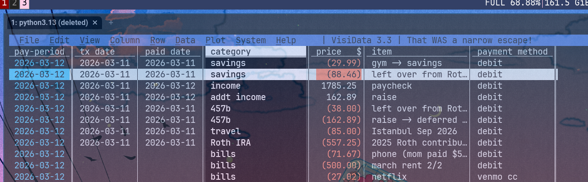

---
title: Using VisiData as my Expense Tracking Tool
date: 2026-03-12
tags: personal-finance, keyboard-only
---  

I've tried budget-tracking apps and spreadsheets but none of em lasted more than a couple weeks. [VisiData](https://github.com/saulpw/visidata) is the only tool that got me to stick to expense-tracking and it's been over a year now. Outside of meal-prep and programming, expense-tracking has been the most impactful skill/habit I picked up in adulthood. So ty VisiData!  

What I like most about it is that nothing besides the income/expenses are "saved," so things like sums have to be re-derived each time I open my expense tracker. That probably sounds inconvenient but the info I need is usually just a few key-strokes away.  

To get the sum of a column I just hover over the column and press `+`, the word "sum", then `Enter`. If I hit `Shift-w` on the pay-period column (each record in my expense-tracker "belongs" to a 2-week pay-period), I get that sum grouped by pay-period. Finding out how much I spent per period on each item category is just hitting `!` on pay-period, then `Shift-w` on the category column.  

None of these summaries get saved (though I think you could), so I don't have to worry about where or how to store this information. With spreadsheets I had to find appropriate locations for this sort of info, or think about if they should be stored on separate sheets. Clicking between 5+ spreadsheet sheets, potentially with different layouts has unfortunately become too cumbersome for me. 

